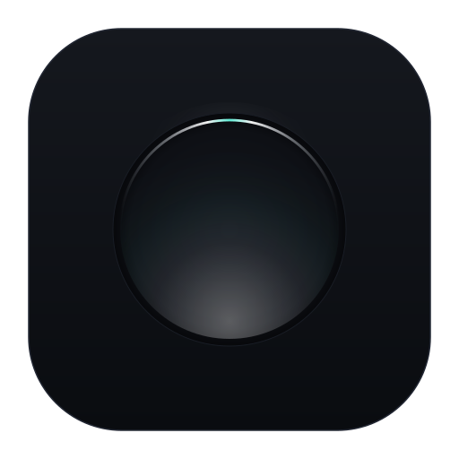

  
  <h1>lumen</h1>
  
<strong>a minimal, bloat-free browser engineered for night environments and technical utility.</strong>

---

### overview

lumen. privacy. light. browse.

### core philosophy

* **zero bloat:** stripped of unnecessary background processes, news feeds, proprietary widgets, and non-essential telemetry.
* **low-contrast night aesthetics:** high-contrast dark tones by default, utilizing soft silver slate and subtle teal/mint optical accents that preserve night-adjusted vision.
* **privacy by default:** aggressive tracker mitigation, strict permission gating, and complete network isolation modes.
* **predictable utility:** minimal memory footprint, deterministic resource consumption, and seamless linux desktop integration.

---

### features

* **l.null mode:** an isolated private browsing session with zero persistent storage, memory sanitization on window close, and disabled network cache.
* **lumen threshold:** an optical guard barrier that intercepts accidental light theme triggers late at night, preventing sudden eye strain.
* **omnibox currency engine:** instant real-time currency conversion directly within the address bar, requiring zero configuration.
* **crafted color palettes:** four psychologically balanced, bespoke schemes designed to eliminate visual fatigue (`noctiluca`, `morion`, `calcite`, `rime`).
* **optics design language:** native wayland/x11 rendering integration with a strict, distraction-free interface.
* **keyboard-centric navigation:** configurable, vim-like keybindings for tab management, url bar access, and process inspection.
* **native desktop assets:** mathematically defined vector assets built to scale cleanly across all display densities (hidpi/wayland scale factors).